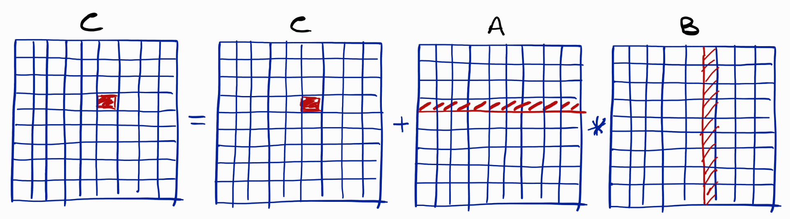

# Matrix-by-matrix on GPU

We are going to study a CUDA code for performing the multiplication
of two matrices. The main aim of this lecture is to give a more detailed
explanation of *coalesced memory access*. A secondary aim is to show
how to define a 2-dimensional topological grid of threads on our GPUs.

Before beginning with this lecture, it is important that you are 
familiar with the lecture, available on this same repository, about 
[cache memory access optimization](../lowlevel/matrix-by-matrix.md).

## One element per thread

The block algorithm presented in the lecture about cache access
optimization "converges back" to the standard algorithm for 
matrix-by-matrix when we can allocate as many computing resources as 
the number of elements forming the resulting matrix ```C```. On GPU, 
this setup gives us the possibility to reuse the standard algorithm
for high performing computations, where the two outer for loops are 
implicitly "implemented" by the GPU grid topology. Basically, only
the inner for loop will have to be executed by each thread, by giving
us the possibility to reduce the actual complexity from $n^3$ to $n$.

The drawing below shows the memory locations that every thread needs
to access in order to perform the computations:



One important point for the GPU implementation is given by the way 
these matrix elements are loaded from the GPU global memory. But
before analyzing this point in details, let's go over the main 
operations in our CUDA program [matrix-by-matrix.cu](./matrix-by-matrix.cu).

## Matrix representation

In order to simplify the transfer of the involved matrices from and to
the GPU global memory, we use 1-dimensional arrays to represent
2-dimensional objects. It will be necessary therefore to often convert
the standard 2D indices $(i,j)$ for the matrix elements into a unique
$k$ index related to the 1-dimensional array:

	__host__ __device__ size_t index(size_t i,size_t j,size_t n)
	{
	   return i*n + j;
	};

Notice that this function is meant to be invoked by both CPU and GPU
devices.

For simplicity, we also suppose that all matrices involved in the 
computations are *squared matrices*.

## Thread grid topology

In our example, the size of the grid representing the topology of the
GPU threads is supposed to perfectly match with the value of ```n```, which
corresponds to the number of rows and columns in our squared matrices.

In the code, the details about the grid topology and the matrix size are 
set up at the top of the main function:

	size_t nblocks = 32;   // nblocks^2 = 1024
	size_t nthreads = 8;  // nthreads^2 = 64
	size_t n = nblocks*nthreads;  // n^2 = 65536

Recall that ```nthreads``` is the number of threads in each block allocated
on the GPU. This value cannot be too large, because otherwise we can risk to
allocate more threads in the same GPU block than the actual number of
physical threads. This is naturally impossible. Notice however that CUDA is
actually able to automatically deal with this kind of situations, but at the 
cost of lowering the overall performances.

The drawing below shows how the threads are organized in the grid topology, 
in a reduced example where ```nblocks``` and ```nthreads``` are both set 
to 3 for a clearer visualization:


## Data transfer

In our program, the matrices ```A``` and ```B``` are initialized with
random real values ranging from 0 to 1. It's the CPU that performs 
this initialization. Then, in order to perform the matrix multiplication 
on the GPU, the elements of the two matrices need to be transferred to its
global memory. Since we opted to have a one-dimensional representation
of the matrices, the memory transfer, via the call to the CUDA function
```cudaMemcpy```, is basically implemented as in the code we studied
in our [previous lecture](./intro_ssp.cu).

## Who is my element?

Each thread is supposed to identify the element of ```C``` that it needs
to calculate. This is trivial in our setup: the identifiers ```idx``` and
```idy``` actually correspond with the indices of this element in the
matrix ```C```. It is only necessary to convert this pair of indices
```(idx,idy)``` into the corresponding index ```ind``` in the 1-dimensional
matrix representation:

	size_t n = blockDim.x*gridDim.x;
	size_t idx = (blockIdx.x*blockDim.x) + threadIdx.x;
	size_t idy = (blockIdx.y*blockDim.y) + threadIdx.y;
	size_t ind = index(idx,idy,n);

Notice the necessity to know the row size ```n```, which can be easily 
obtained from the configuration of the grid topology.

## A kernel to set up all elements to zero

This CUDA program has two kernels, not only one. We will in fact invoke
the GPU twice! The first time, we invoke the first kernel, named 
```zero_matrix```, to make sure that the elements of the matrix ```C```
on the GPU are all set to 0:

	__global__ void zero_matrix(float *M);

In the main function, we can launch this kernel with the following lines
of code:

	dim3 blocks(nblocks,nblocks);
	dim3 threads(nthreads,nthreads);
	zero_matrix<<<blocks,threads>>>(CG);
	cudaDeviceSynchronize();

We remark that ```dim3``` is a data type introduced in CUDA to represent
3-dimensional vectors of integers, representing the dimensions of our GPU
grid (and yes, we can also define 3-dimensional grids!). In our code,
```CG``` is the pointer on the global memory to the matrix ```C```.

## The main kernel

At this point, you should have all basic information to fully understand
the code composing our second kernel, in charge of performing the 
matrix-by-matrix multiplication:

	// matrix-by-matrix GPU version
	__global__ void matrix_by_matrix(float *AG,float *BG,float *CG)
	{
	   size_t n = blockDim.x*gridDim.x;
	   size_t idx = (blockIdx.x*blockDim.x) + threadIdx.x;
	   size_t idy = (blockIdx.y*blockDim.y) + threadIdx.y;
	   size_t ind = index(idx,idy,n);

	   for (size_t k = 0; k < n; k++)
	   {
	      CG[ind] = CG[ind] + AG[index(idx,k,n)]*BG[index(k,idy,n)];
	   };
	};

## An execution on NVIDIA T4 Tensor Core 

This is the output of the execution:

	Matrix-by-Matrix on GPU with CUDA
	Two-dimensional thread grid structure: [blocks (32,32), threads (8,8)]
	Memory allocation on RAM ... done in 7e-06 seconds
	Setting up to zero all elements of C matrix on RAM ... done in 0.00014 seconds
	Random generation of matrices A and B ... done in 0.002044 seconds
	Sequential version ... done in 0.106721 seconds
	Memory allocation on GPU ... done in 0.280111 seconds
	Setting up to zero all elements of C matrix on GPU ... done in 5.1e-05 seconds
	Transferring A and B to the global memory ... done in 8.8e-05 seconds
	CUDA version of matrix-by-matrix ... done in 0.000443 seconds
	Transferring the result to the RAM ... done in 7.8e-05 seconds
	Verifying the results ... done in 0.00035 seconds, results are OK

The GPU version is **almost 3 orders of magnitude** faster than the sequential 
version! If we rather use the block algorithm explained in 
[this lecture](../lowlevel/matrix-by-matrix.md),
we can reduce the computational cost of the sequential algorithm up to 25% of
the current cost, but the GPU will still be the "winner".

Give a look however at the time necessary to allocate memory on the GPU global
memory. When a consistent amount of memory is required on the GPU, it is necessary 
to take the allocation time into consideration when evaluating the overall 
performances. In our specific example, we can say that it would not make sense to 
run *only one matrix-by-matrix* multiplication on the GPU. If we have several
multiplications to execute, however, then the memory allocation step can be 
executed only once and the same memory locations can be reused to perform all
the multiplications.

## But what about the memory access?

We can make two main remarks.

Firstly, the concepts introduced in [this lecture](../lowlevel/matrix-by-matrix.md)
about cache memory access optimization are still valid when working with GPUs.
In our example, the access to the memory is performed through contiguous locations 
when the elements of the matrix ```A``` are accessed. But we cannot say the same for
the elements of ```B```, because a column of the matrix ```B``` needs to be selected
by each thread, whereas we made the choice to represent our matrices row by row.

But this is not all. It is important to know that GPU blocks are collections of 
smaller "blocks" named *warps*. Each warp contains a certain number of threads which
are all controled by the same controling unit. Moreover, warps also ensure the 
communication between the global memory and the thread registers. This implies that,
when the synchronized threads belonging to a common warp execute a *retrieve* 
operation from the global memory, it is actually the warp that performs the 
operation *for all of them*. This means that, if the memory locations to access
are contiguous, then the retrieval can be performed in one unique step. When this
is not the case, more than one memory transfer from the global memory is actually
necessary, making the overall operation slower.

This "second level" of contiguity in CUDA programming is known under the name of 
**coalesced memory access**.

The drawing below summarizes the previous two paragraphs in a graphical way (and 
using, again, the smaller topology employed for the previous drawing; this
topology is so small that we can confuse blocks with warps):


The memory access to the elements of ```A``` is contiguous, but at the very 
first step, when the first element of each row is retrieved, the access is not
always coalesced. This implies that the warp may have to perform several 
communication steps with the global memory. The access to the elements of 
```B```, instead, is always coalesced.

## Can we do better?

It looks like the standard algorithm for matrix-by-matrix better fits with
the structure of a GPU, rather than with CPU architectures. In fact, while the 
elements of ```A``` are accessed in a contiguous way, the elements of ```B```, 
for which we can define their access as *catastrophic* on CPU, are accessed
in a coalesced manner on the GPU. There is only one drawback: the very first 
access to the first element of each row of ```A``` is not coalesced on GPU.

What about changing the two-dimensional grid topology in an attempt to improve 
the memory access?


In our CUDA code, if we change the topology so that the blocks are organized
in a $256 \times 4$ grid, and the threads in each block are organized in
a $1 \times 64$ grid, then our code becomes 3 times faster!

	Matrix-by-Matrix on GPU with CUDA
	Two-dimensional thread grid structure: [blocks (256,4), threads (1,64)]
	Memory allocation on RAM ... done in 8e-06 seconds
	Setting up to zero all elements of C matrix on RAM ... done in 0.000137 seconds
	Random generation of matrices A and B ... done in 0.00205 seconds
	Sequential version ... done in 0.105837 seconds
	Memory allocation on GPU ... done in 0.181113 seconds
	Setting up to zero all elements of C matrix on GPU ... done in 5.1e-05 seconds
	Transferring A and B to the global memory ... done in 8.7e-05 seconds
	CUDA version of matrix-by-matrix ... done in 0.000148 seconds
	Transferring the result to the RAM ... done in 6.1e-05 seconds
	Verifying the results ... done in 0.000267 seconds, results are OK

## Links

* [Next: shared memory](./shared-matrix.md)
* [Back to HPC lectures](./README.md)
* [Back to main repository page](../README.md)

