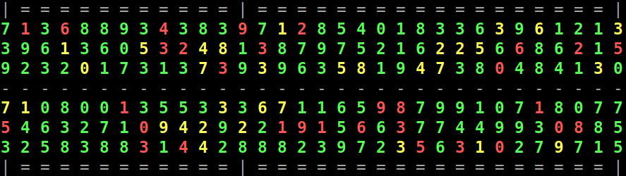

# AirSimulation

The director of an Airline company wishes to improve the performances of his small 
group of agents. The instructions that the agents execute are supposed to be specified 
in Java language. Every agent is supposed interacting mainly with the Java class 
named ```Aircraft```, which represents an aircraft through its map of seats and makes 
use the following Java files:

- ```Seat```, a common interface for the objects that can form the seat map of an aircraft;
- ```Customer```, an implementation of ```Seat``` representing a customer;
- ```Window```, an implementation of ```Seat``` which represents a window in the seat map;
- ```Aisle```, an implementation of ```Seat``` which represents an aisle in the seat map.

The director wants his agents to get used to work with a new computer system, where 
agents will not have to wait for one another in order to have access to the reservation 
system. In order to help the director to achieve this task, our initial task will consist 
in looking at the implementation of the provided Java classes, available here in the current
directory of the repository. The director himself has coded these classes, and he says you 
should not modify his code without his authorization.

Notice that, among the attributes of ```Customer```, you can find its age, its frequent
flyer level, and the information on whether the customer needs special assistance or not.
An object of the ```Aircraft``` class can be visualized through the ```toString``` method 
as follows:



where the red color is used to represent customers that need assistance, the yellow color 
indicates customer that are over 70, while the green color marks all other customers. The 
displayed numerical value is the flyer frequency number of the customer (the higher, the 
most frequent). In case your color system is not compatible with the one used by the 
director, you'll have to modify the provided ```toString``` method.

## Simulating the behavior of a set of agents

### The two main agents

The director had asked each of his agents to write a Java class indicating the actions they
perform for the reservation of a customer seat in a given flight. The two main agents, *agent1*
and *agent2*, wrote their Java code immediately upon the director's request. To make things
easy (for themselves), they negleted some details, but the two codes seem nevertheless able to
work properly (notice that we don’t need to correct or improve these codes). Before continuing,
please give a look at these classes.

### The third agent

The third agent is a little ashamed to reveal the way he proceeds, and this is the reason why
he has not written yet his Java code. In practice, the director has recruited him with the aim 
of taking care of the mistakes that the other two agents may make in their reservations. The main
task of this third agent is in fact to verify if customers with a high frequent flyer number are
actually positioned "in front of" customers with a smaller flyer number. As you can see from
the codes of *agent1* and *agent2*, they both do not consider at all this kind of information 
when placing a customer on a given seat.

The shame of *agent3* comes from the fact that his method is not really professional. In practice, 
this agent scans the seat map by using the provided iterator (which begins the iterations starting
from the front seats), and every time he finds a customer with a low frequent flyer level (say
smaller than 3), then it simply removes this customer and it replaces it with a new one having
a higher frequent flyer number ...

Since we urge to continue working on this project, the director kindly asks you to code the Java
class implementing the behavior of *agent3* as indicated above. You can simply create new
Customers with the provided constructor when necessary.

### A new computer system

In order to improve the overall performances of the Airline, the director proposes therefore to
install a new multi-tasking computer machine with shared memory. Every agent can this way be
associated to one single and independent computing resource. In Java, this can be implemented
by using the ```Thread``` class. New threads can be invoked from a running process with the
```start()``` method in Thread, but it is important to remark that the default implementation 
of ```Thread``` is empty. It is necessary therefore to extend the Thread class in order to 
specify what code every new generated thread needs to run. To do so, the ```run``` method 
of ```Thread``` needs to be overridden (when start is invoked, the code in ```run``` is in 
fact be executed). It is your task to change the code in order to have the three agents running 
on three independent parallel threads. When you're done, then perform some tests. Does the 
system always work properly? If not, try to isolate the agents that are likely to cause 
troubles.

### More troubles in the Airline

An ancient employer, apparently kicked out from the Airline company for no serious reasons, is
able to introduce a virus in the new Airline computer system. The code implementing a new agent, 
let’s call it *agent4*, is included in the Java project by the virus. This new agent consists of
the following main code:

	public void run()
	{
	   Aircraft.SeatIterator seatIt = this.aircraft.iterator();
	   try
	   {
	      while (true)
	      {
	         Customer c = seatIt.next();
	         if (c != null)
	         {
	            seatIt.remove();
	            seatIt.place(c);
	         }
	      }
	   }
	   catch (Exception e)
	   {
	      return;  // iterations are over
	   }
	}

Introduce the new agent in your Java project and test it again. You'll see that the virus made 
the new computer system completely useless!

### An expert suggestion

Very concerned for his new computer system, the director asks for an expert advise. The expert
explains to the director that, in this kind of computer systems, the memory is shared by the
agents and it is necessary to pay particular attention to the way every agent has access to it. 
In Java, he continues, ```Semaphores``` can be used for controlling the access to memory resources.
Even if the director had never heard about ```Semaphores``` before, after a quick online search, 
he finds some simple examples that allow him to fix the system! By using only one Semaphore, he 
makes sure that only one agent per time can have access to the seat map. Thanks to this 
modification, the system is working again, while the virus is still active (*agent4* continues
to run the code given above; actually the director had not recognized the virus code and he has
introduced the ```Semaphore``` also in there ...).

### Doubts about the overall performances

After having successfully fixed the system (even if the virus is still running), all director 
happiness fades away when he finds out that the use of ```Semaphores``` makes his system slower. 
And actually, the computer system is now even slower than his old system. A solution is necessary 
in order to make the system competitive again with the old one. Can you imagine a less restrictive 
use of ```Semaphores``` that allows the new computer system to avoid crashing? At the end, the 
director's happiness is totally in your hands!

## Links

* [Back to main repository page](../../README.md)

