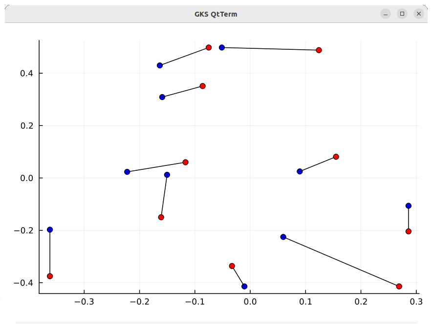

# Another linear program: Adaptive Maps

In this lesson, we are going to study another linear program, but this
time this is not just a simple example to learn about linear programming.
What we consider in this lesson is an open problem on which research is 
currently going on.

## Adaptive maps

You're visiting Andalusia and exploring the beautiful city of Granada.
Your GPS device tells you that the cathedral is a few meters away from your 
current location, something like 200 meters away. Just follow the street, 
turn right, and the cathedral is going to appear just in front of you.
"Cool, let's go", you say to your friends. On your short way to the cathedral,
another group of tourists asks you for directions for the cathedral, and you 
just repeat to them what you had just learned from your GPS device: "just turn
right over there, and the cathedral will be in front of you". Your reply is
so immediate that you miss to pay attention to the fact that there is a person 
in wheelchair in that group. And unfortunately, once in front of the cathedral, 
this person is going to be faced with a quite important obstacle, at least 
important for somebody seating on a wheelchair: from the current location, 
it is necessary to climb a few steps in order to get access to the pavement 
where the cathedral stands. This person (and hence for the entire group) would 
have much more preferred to have a longer path to the cathedral, instead of 
having to deal with this obstacle. "What about conceiving a map that
adapts to the mobility conditions of the user?", you would at this point
propose.

A possible definition of the "adaptive map problem" is as follows. 
Given a standard geographic map, a subset of Points of Interest (POIs),
and a set of non-Euclidean distances between such POIs, is there 
any *map distortion* that may allow us to satisfy the available distances 
between POIs? Below, we are going to consider only a sub-problem of
the more general problem: given an initial set of positions for the POIs
in the two-dimensional space, we will try to relocate these POIs in such 
a way to satisfy the available distances constraints, as long as it 
is possible. We refer to this sub-problem to as the *POI relocation* 
problem.

The choice of introducing adaptive maps through a short fiction taking
place in Granada is not random. One of the most active researchers in
the field lives in Spain and works at the University of Granada. You 
can watch an introduction to adaptive maps given by this colleague and
collaborator in this [YouTube video](https://www.youtube.com/watch?v=eiY5nmaJsTA).

## A linear program: definition and solution in Julia

We are going to follow the main steps of the method recently proposed in 
[this conference paper](https://link.springer.com/chapter/10.1007/978-3-031-38299-4_57),
which is based on the formulation of a linear program. 
[This article](https://onlinelibrary.wiley.com/doi/abs/10.1002/int.22058)
contains some data one can use for testing methods for adaptive maps.
In the following, we'll be using the data from "example A" taken from
that publication (Table A1).

### Loading the data

We are going to use Julia in an interactive way. Since the "example A" is 
composed by 10 POIs, the first thing to do is to set up ```n```:

	n = 10;

Then, we load the known two-dimensional coordinates, which we store in two 
vectors named ```p``` and ```q``` (we reserve the names ```x``` and ```y``` 
for the variables of our linear program):

	p = [0.124, -0.075, -0.086, -0.117, -0.161, -0.362, -0.033,  0.269,  0.286, 0.155];  # known x coordinates
	q = [0.488,  0.498,  0.351,  0.060, -0.150, -0.375, -0.336, -0.414, -0.204, 0.081];  # known y coordinates

Finally, we load the distance matrix ```D```, which contains *walking distances*
represented in units of time, instead of standard Euclidean distances:

	D = [   0 1553 2783 3614 4240 5674 6972 6064 7408 5387;
	     1553    0 1674 3867 2975 5936 7234 6326 6807 4693;
	     2783 1674    0 3427 2118 5098 6396 5409 5950 3837;
	     3614 3867 3427    0 2471 2571 4609 3745 5222 3292;
	     4240 2975 2118 2471    0 3600 4684 3172 3840 1727;
	     5674 5936 5098 2571 3600    0 2569 3076 5083 3416;
	     6972 7234 6396 4609 4684 2569    0 2692 4966 3903;
	     6064 6326 5409 3745 3172 3076 2692    0 2415 1698;
	     7408 6807 5950 5222 3840 5083 4966 2415    0 2303;
	     5387 4693 3837 3292 1727 3416 3903 1698 2303    0];

### Conception of our model

Our approach to the POI relocation problem is based on the two following 
observations:

1. We impose that the local orientations of the POIs are preserved
   in our solutions. Given two POIs A and B, in fact, we can define 
   a Cartesian system where A is positioned in the origin, and where 
   B appears in one of the 4 quadrants (NW,NE,SW,SE). Therefore, we
   impose that B must remain in the same quadrant when the Cartesian
   system centered in A is reconstructed from the coordinates forming
   the found solutions.
2. We replace the Euclidean norm with the $L_1$ norm, hence making
   our problem linear (the Euclidean norm would have made our problem
   at least quadratic). 

Notice that the *linearization* of the Euclidean norm is not trivial,
and it requires in general the inclusion of additional variables in
the model. In our case, however, this substitution does not need any
additional variables, because of the introduced constraints on the
orientations.

The linear program is provided in the file [admaps.jl](./admaps.jl).
Its objective function measures the violations of the newly imposed
distance constraints between POIs. No more details about the linear
program are provided in this page: it is up to you to discover now
it works. In the following, we'll only focus our attention on how to 
use Julia to visualize the results by using the ```Plots``` package.

### Visualizing the result

After running the Julia script in the file [admaps.jl](./admaps.jl),
we'll find the new coordinates for the POIs in the two vectors named
```xc``` and ```yc```. In order to compare them with the original 
coordinates (still stored in ```p``` and ```q```), we need to *align*
their coordinate systems. To this purpose, we will apply translation 
and resizing operations, but not rotations, because they may alter 
the local orientations that we have imposed in our model.

In our little example, we can remark that the minimum values for 
both coordinates ```xc``` and ```yc``` are already 0. So, in order
to perform a normalization in $[0,1]$, we only need to perform the
following operation:

	xc = xc ./ maximum(xc);
	yc = yc ./ maximum(yc);

Notice the use of period ```.```, which indicates that the operator
(```/```) is to be applied to all elements of the two vectors.
Next, we compute the range of the original coordinates:

	prange = maximum(p .- minimum(p));
	qrange = maximum(q .- minimum(q));

and we impose it on the coordinates in our solution:

	xc = xc .* prange;
	yc = yc .* qrange;

Finally, we translate these coordinates so that the minimum
coordinates correspond to those in the original system:

	xc = xc .+ minimum(p);
	yc = yc .+ minimum(q);

Now we can finally visualize the result obtained from our linear
system:

	using Plots;
	scatter(xc,yc;color=:blue,legend=false)  # The solution
	for i in 1:n
	   plot!([p[i],xc[i]],[q[i],yc[i]];color=:black)  # Segments connecting original and new coordinates
	end
	scatter!(p,q,color=:red)  # The original coordinates for the POIs

And here's how the plot looks in Julia:



You're invited to read the code above to distinguish between red
and blue points. 

## References

Notice that the real problem is much more complex. For example, there 
are various ways to construct the Cartesian systems centered in the 
coordinates of POIs, and this flexibility is in fact one of the 
research lines currently under investigation to improve the obtained 
results. If you're interested to knowing more about this problem, 
please read (or watch) the provided additional material!

## Links

* [Next: integer linear programs](./integer-programs.md)
* [Back to math programming lectures](./math-prog.md)
* [Back to main repository page](../README.md)

