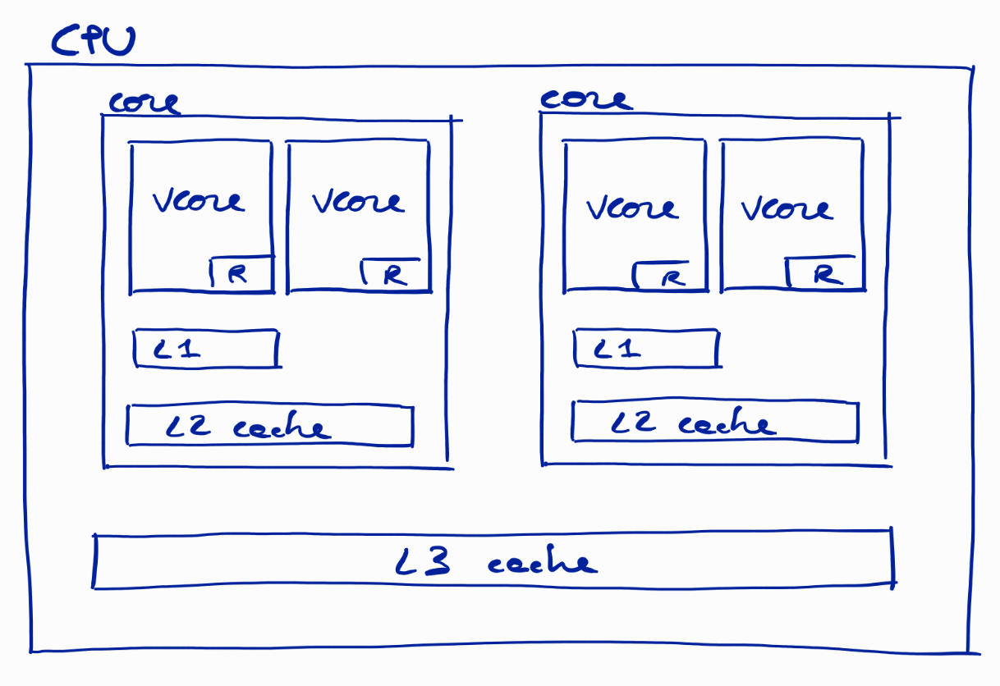
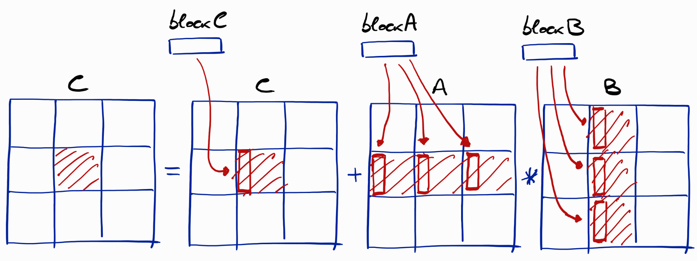

# Cache memory optimization

Given a specific procedure, composed by a certain number of operations,
which we suppose to be independent from each other, one may supposed 
that the order in which these operations are performed has normally no 
impact on the performances of the overall procedure. This is not true
on computer machines.

## Basic algorithm for matrix-by-matrix

Take the basic algorithm for performing the multiplication of
two matrices. Suppose all our matrices are squared matrices, and 
that each matrix is represented in C programming language as an 
array of pointers to one-dimensional arrays, each representing a 
matrix row:

	double** matrix_zeros(size_t n)
	{
	   assert(n > 0UL);
	   double** A = (double**)calloc(n,sizeof(double*));
	   for (size_t i = 0; i < n; i++)  A[i] = (double*)calloc(n,sizeof(double));
	   return A;
	};

The basic (and simple) algorithm for the multiplication of the
matrix ```A``` by the matrix ```B```, which sums up the result
to another existing matrix ```C``` (which could initially be the 
zero matrix), is:

	void mbm_simple(size_t n,double **A,double **B,double **C)
	{
	   assert(n > 0UL);
	   for (size_t i = 0; i < n; i++)
	   {
	      for (size_t j = 0; j < n; j++)
	      {
	         for (size_t k = 0; k < n; k++)
	         {
	            C[i][j] = C[i][j] + A[i][k]*B[k][j];
	         };
	      };
	   };
	};

For matrices having size $1000 \times 1000$, one core of a small Intel(R) 
Atom(TM) x5-Z8350 CPU (1.44GHz) takes about **40 seconds** to compute 
the resulting matrix. This lesson has as main aim to explore possible 
ways to improve the algorithm performance, but without reducing the 
number of required operations. Rather, we will change the *order* on 
which the operations are performed.

The key to understand why the order of the operations is important can
be found in the particular way memory caching works. Modern CPUs are in
fact equipped with many cache memories, at different levels, where data 
transferred from the main memory (RAM) are stored before being finally 
transferred to the core registers. On their way to the registers, the
data are initially stored in the L3 cache, which is common to all CPU
cores in the drawing below. Subsequently, the data are transferred to
the L2 cache, and then to the L1 cache, both specifically serving the 
cores that have requested such data. The core registers finally receive 
the data from the corresponding L1 caches. Naturally, when data are 
transferred in the other direction, i.e. from the registers to the RAM, 
the opposite path through the cache memories is taken.

This particular data transfer strategy takes advantage of the fact that, 
in general, when an algorithm has just used a given piece of data, then it 
is very likely it will subsequently need to use another piece of data that 
*lies in memory very close to the one used before*.



This might seem to be always the case for our simple algorithm for matrix 
multiplications: once loaded in the cache, the three matrices are going
to stay in the cache as long as our algorithm is running? No, this is
actually not possible, even for relatively small matrices. In fact,
cache memories are normally small in size, because in fact, the larger 
they are, the slower they become. In general, therefore, the three
matrices cannot entirely fit in the cache memories. As a consequence,
during the execution of our simple algorithm, parts of the three matrices 
will have to be loaded back and forth from and to the main memory. This 
data transfer is the cause of an important reduction on the performances 
of our algorithm. **How many seconds out the 40 seconds reported above 
are actually spent by transferring data?** Try to guess!

## Block algorithm

This is an implementation of the "block" algorithm for performing a
matrix-by-vector multiplication. Basically, this algorithm changes the
order of the operations for ensuring that, once a vector or matrix
element is loaded into the cache memory, it is used in as many operations
as possible, before being replaced by other data. This way, the data 
transfers between main memory and cache memory are reduced. 

We suppose that:

	assert(N%NBLOCKS == 0UL);

so that this division:

	size_t L = N/NBLOCKS;

gives an integer number. Please study the C function below in order to 
deduce the basic idea behind the block algorithm:

	void mbm_blocks(size_t nblocks,double **A,double **B,double **C,size_t L,double **blockA,double **blockB,double **blockC)
	{  
	   assert(nblocks > 0UL);
	   assert(L > 0UL);
   
	   // performing computations by blocks
	   for (size_t iblock = 0; iblock < nblocks; iblock++)
	   {
	      for (size_t jblock = 0; jblock < nblocks; jblock++)
	      {
	         for (size_t i = 0; i < L; i++)  blockC[i] = &C[iblock*L + i][jblock*L];
   
	         for (size_t kblock = 0; kblock < nblocks; kblock++)
	         {
	            for (size_t i = 0; i < L; i++)  blockA[i] = &A[iblock*L + i][kblock*L];
	            for (size_t k = 0; k < L; k++)  blockB[k] = &B[kblock*L + k][jblock*L];
	            mbm_simple(L,blockA,blockB,blockC);
	         };
	      };
	   };
	};

You can also make reference to the figure below:



Finally, please try to answer to the following questions:

- Can we say that the block algorithm uses twice the basic algorithm for
  matrix-by-matrix multiplication? One time for the blocks, and another
  time for the elements forming the blocks?
- Why is it necessary to introduce the temporary arrays named ```blockA```, 
  ```blockB``` and ```blockC``` ? Do these array contain copies of the 
  matrix elements? If yes, should the computational cost actually increase 
  because of the time necessary to perform the copies?

By the way, this implementation of the block algorithm 
**takes only 29 seconds for performing the same matrix multiplication!** 
This implies that the time we saved by avoiding useless memory transfers 
is more than 10 seconds, which is about 25% of the total time necessary to
the basic algorithm for computing the multiplication!

This [C file](./matrix-by-matrix.c) contains the functions reported above,
together with other auxiliary functions and the main function. Don't 
hesitate to download it and to perform some tests on your machine!

## Links

* [Next: My own absolute value function](./myabs.md)
* [Back to low-level programming](./README.md)
* [Back to main repository page](../README.md)

